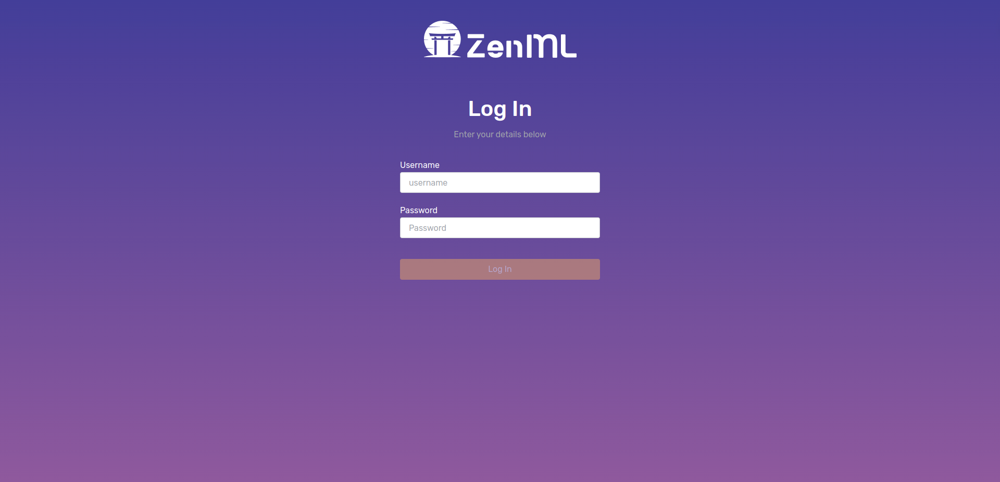
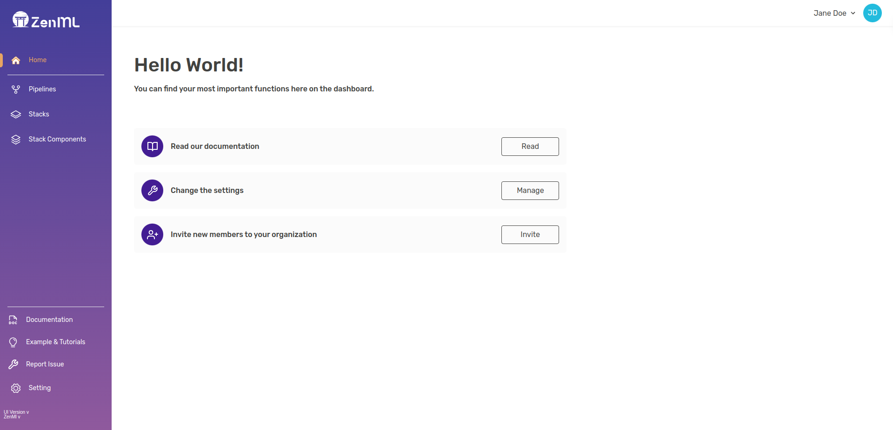
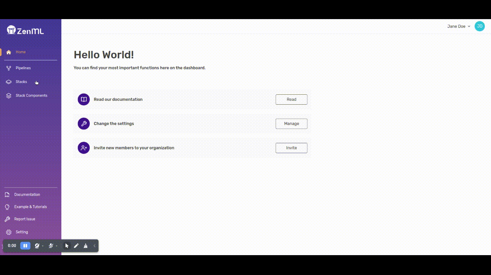

<!-- PROJECT LOGO -->
<br />
<div align="center">
  <a href="https://zenml.io">
    
  </a>

  <h3 align="center">Open-source companion dashboard for
   <a href="https://github.com/zenml-io/zenml">ZenML</a>.
  </h3>
  
  <p align="center">
    Manage and visualize your ML pipelines, stacks and artifacts in one place.
    <br />
    <a href="https://docs.zenml.io/"><strong>Explore the docs »</strong></a>
    <br />
    <div align="center">
      Join our <a href="https://zenml.io/slack-invite" target="_blank">
      
    <b>Slack Community</b> </a> and be part of the ZenML family.
    </div>
    <br />
    <a href="https://zenml.io/features">Features</a>
    ·
    <a href="https://zenml.io/roadmap">Roadmap</a>
    ·
    <a href="https://github.com/zenml-io/zenml-dashboard/issues">Report Bug</a>
    ·
    <a href="https://zenml.io/discussion">Vote New Features</a>
    ·
    <a href="https://blog.zenml.io/">Read Blog</a>
    ·
    <a href="#-meet-the-team">Meet the Team</a>
    <br />
    <a href="https://www.linkedin.com/company/zenml/">
    
    </a>
    <a href="https://twitter.com/zenml_io">
    
    </a>
  </p>
</div>

<!-- TABLE OF CONTENTS -->
<details>
  <summary>🏁 Table of Contents</summary>
  <ol>
    <li>
      <a href="#-getting-started">⚡ Getting Started</a>
      <ul>
        <li><a href="#-installation">🔋 Installation</a></li>
        <li><a href="#-relationship-with-zenml">👨‍👦 Relationship with ZenML</a></li>
        <li><a href="#-deploying-the-dashboard">🪐 Deploying the dashboard</a></li>
      </ul>
    </li>
    <li>
    <a href="#-user-experience">🏄 User Experience</a>
    <ul>
        <li><a href="#-log-in">🔐 Log In</a></li>
        <li><a href="#-home-page">🏠 Home Page</a></li>
        <li><a href="#-pipelines-stacks-and-components">🗂 Pipelines, Stacks, and Components</a></li>
      </ul>
    </li>
    <li><a href="#-contributing">🙌 Contributing</a></li>
    <li><a href="#-meet-the-team">👩‍👩‍👧‍👦 Meet the Team</a></li>
    <li><a href="#-getting-help">🆘 Getting Help</a></li>
    <li><a href="#-license">📜 License</a></li>
  </ol>
</details>

<br />


# ⚡ Getting Started

## 🔋 Installation

The installation is as follows:

First, there is a pre-requisite to use [`node`](https://www.npmjs.com/) version 14.20.0 exactly. One can do this by installing the [`nvm`](https://github.com/nvm-sh/nvm) utility and then doing 

```
nvm install 14.20.0
nvm use 14.20.0
```

Users also need to have [`yarn`](https://yarnpkg.com/) installed.

Then you can run it by doing:

```
yarn install
yarn start
```

To build it:

```
yarn build
```

The app takes the following env variables:

```
REACT_APP_BASE_API_URL="<YOUR_ZENML_SERVER_DEPOLOYMENT_URL>/api/v1"
```

To learn how to get the `YOUR_ZENML_SERVER_DEPOLOYMENT_URL`, read the [deployment guide](https://docs.zenml.io/getting-started/deploying-zenml/deployment).

Lastly, if you would like to use Docker, then the ZenML team provides [DockerHub] images to serve the ZenML Server and Dashboard in one image:

```shell
docker run -it -d -p 8080:80 zenmldocker/zenml-server
```

Which will serve the dashboard with the server at `http://localhost:8080`, with username `default` and an empty password.

## 👨‍👦 Relationship with ZenML

The ZenML Dashboard is a Javascript React-based application that lives inside this repository, which is a sister repository of the main [ZenML Python package repo](https://github.com/zenml-io/zenml). 

> **Note** - The ZenML Dashboard is meant to be used with the ZenML Server as a backend and cannot be used standalone.

The dashboard build files come bundled into the [ZenML PyPi package](https://pypi.org/project/zenml/) and can be [served locally](https://docs.zenml.io/getting-started/deploying-zenml/using-cli.md) and/or [deployed on the cloud](https://docs.zenml.io/getting-started/deploying-zenml/deployment.md) through the main ZenML python package.

Basically, each ZenML `Python` package comes with the build files (generated by `yarn build`) of a certain version of this dashboard (all build files of the dashboard can be seen in the [releases](https://github.com/zenml-io/zenml-dashboard/releases) section of this GitHub repo). Therefore, each ZenML PyPi package has bundled in it a corresponding version of this dashboard.

With the `Python` package, you can then serve these static build files by doing:

```
zenml up
```


Which creates a local daemon that serves the files in a [FastAPI](https://github.com/tiangolo/fastapi) server!

## 🪐 Deploying the dashboard

You can deploy this dashboard on supported cloud providers with ZenML python package by using the command: 

```
zenml deploy
```

The above command deploys the dashboard in the [same process as the ZenML Server](https://docs.zenml.io/getting-started/deploying-zenml/deployment.md), and automates a lot of the nitty gritties for you.

However, the option to deploy standalone is also available. `yarn build` creates a build directory with a production build of the dashboard. Set up your favorite HTTP server so that a visitor to your site is served index.html. Here are [8 ways to deploy a React app for free](https://blog.logrocket.com/8-ways-deploy-react-app-free/) as a starting point.

Just don't forget to the set the `REACT_APP_BASE_API_URL` environment variable!

# 🏄 User Experience

## 🔐 Log In



## 🏠 Home Page


## 🗂 Pipelines, Stacks and Components



# 🙌 Contributing

We would love to develop ZenML together with our community! Best way to get
started is to select any issue from the [`good-first-issue`
label](https://github.com/zenml-io/zenml-dashboard/labels/good%20first%20issue). 

If you would like to contribute, please review our [Contributing
Guide](CONTRIBUTING.md) for all relevant details.


# 👩‍👩‍👧‍👦 Meet the Team


Every week, the ZenML [core team](https://zenml.io/company#CompanyTeam) will pop in for 30 minutes to interact directly with the community. 
Sometimes we'll be presenting a feature, other times we'll take questions and have fun. 

[Register now](https://zenml.io/meet) for the ZenML Meet the Community session. It's free and open to everyone.

Or subscribe to our [public events calendar](https://calendar.google.com/calendar/u/0/r?cid=Y19iaDJ0Zm44ZzdodXBlbnBzaWplY3UwMmNjZ0Bncm91cC5jYWxlbmRhci5nb29nbGUuY29t) to get notified 
before every community gathering.

# 🆘 Getting Help
By far the easiest and fastest way to get a response is to:

1. Ask your questions in [our Slack group](https://zenml.io/slack-invite/).
2. [Open an issue](https://github.com/zenml-io/zenml-dashboard/issues/new/choose) on our GitHub repo.


# 📜 License

ZenML Dashboard is distributed under the terms of the Apache License Version 2.0. 
A complete version of the license is available in the [LICENSE](LICENSE) file in
this repository. Any contribution made to this project will be licensed under
the Apache License Version 2.0.
